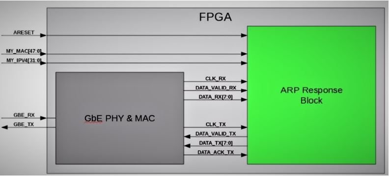
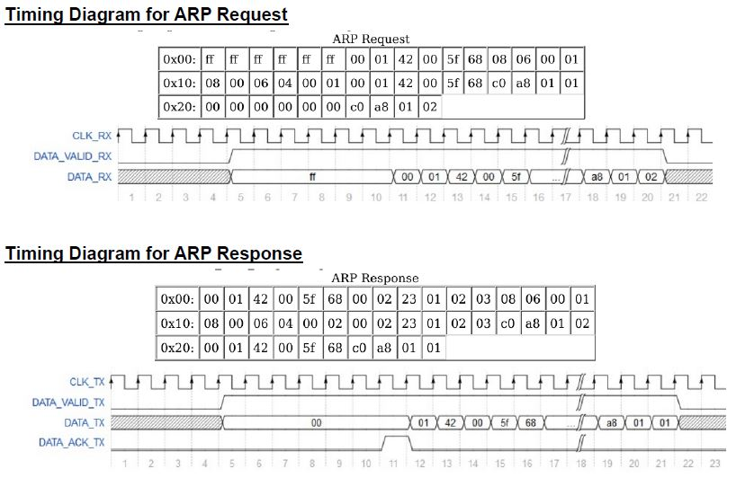
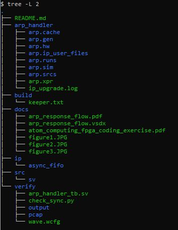
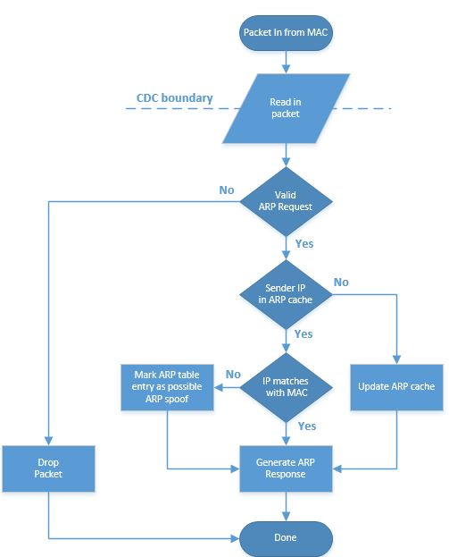

# Atom Fpga April

Atom Computing FPGA coding exercise submission for Steve April

## VERSION HISTORY

| **Version**  | **Date**  | **Description**                       |
|--------------|-----------|---------------------------------------|  
|  1.0         | 12-APR-21 | Initial release                         

#### Information and Tools

| **Organization**    | Atom Computing                             |
|---------------------|--------------------------------------------|  
| **FPGA Name**       | atom-fpga-april  
| **Design Name**     | ARP handler (PC-B)  
| **File Name**       | arp_handler.sv  
| **MTS**             |[Steve April](mailto:steve.j.april@gmail.com?subject=GitLab_atom-fpga-april)  
| **Language-1**      | SystemVerilog 
| **Device**          | XQZU29DR-FFRF1760-2I RFSOC (example) 
| **Tool versions**   | Xilinx Vivado 2020.2 for Logic Simulation
| **Development Host**| Windows 10 Professional 64-bit.   

Address Resolution Protocol (ARP) allows Layer 3 protocols such as IPv4 to discover the Layer 2 Ethernet MAC address of a networked device. 

## ASSIGNMENT
#### Typical ARP Response Flow 
Please refer to Figure-1.   
- PC A and PC B have Ethernet connections to the same IPv4 Local Area Network (LAN).   
- PC A’s IP address is 192.168.1.1 and PC B’s IP address is 192.168.1.2.   
- PC A must have PC B’s Ethernet MAC address in order to route a data packet from PC A to PC B.   
- PC A sends an ARP Request to PC B to 192.168.1.2. PC B will respond to the request with an ARP response that contains its Ethernet MAC address.  

   
***Figure-1: MAC Interface with ARP Block***

#### Parameters
| Parameter Name | Type     | Default     | Notes                           |
|----------------|----------|-------------|---------------------------------| 
|  MAC_W         | shortint |   48        |  48-bit MAC (hardware) address  |
|  IPV4_W        | shortint |   32        |  32-bit IPv4 IP address         | 
|  RX_W          | shortint |    8        |  Payload width on receive side  | 
|  TX_W          | shortint |    8        |  Payload width on transmit side |
|  H_SIZE        | shortint |    MAC_W/8  |  Hardware (MAC) address size    |
|  P_SIZE        | shortint |    IPV4_W/8 |  IP (IPv4) address size         |
|  REQUEST       | shortint |    0001     |   ARP Opcode (Request)          |
|  REPLY         | shortint |    0002     |   ARP Opcode (Reply)            |

#### I/O Signals 

| Port Name     | Direction | BitWidth | Description                        |
|---------------|-----------|----------|------------------------------------| 
| areset        | Input     |    1     | Active high, asynchronous reset    |
| my_mac        | Input     |   48     | MAC address for Ethernet port (static)
| my_ipv4       | Input     |   32     | IPv4 address for Ethernet port (static)
| clk_rx        | Input     |    1     | CLock for DATA_RX and DATA_VALID_RX. This clock has a frequency of 125 MHz +/- 300 ppm and is recovered from GBE_RX input into the MAC.
| data_valid_rx | Input     |     1     | Ethernet frame data valid. Goes high when a valid Ethernet frame has been received and stays high for the entire duration of the received Ethernet frame (not including the Preamble, Start of Frame, or FCS bytes).
| data_rx       | Input     |      8     | Received Ethernet frame data (does not include preamble, Start of Frame, and FCS bytes). Valid when RX_DATA_VALID is high.
| clk_tx        | Input     |      1     | Clock for DATA_VALID_TX, DATA_TX, and data_ack_tx.  Derived from an on-board oscillator. 125 MHz +/- 100 ppm  
| data_valid_tx | Output    |      1     | Ethernet frame data valid.  Goes high when the first byte of the Ethernet frame begins to transmit. MAC responds with data_ack_tx when it is ready to receive additional bytes.  
| data_tx       | Output     |     8     | Transmit Ethernet frame data.  Must be valid when data_valid_tx is high.  
| data_ack_tx  | Output     |      1     | Acknowledgment signal from the Ethernet MAC that goes high when MAC is ready to receive additional DATA_TX bytes.  Stays high only for a single clock cycle.    
 
#### Timing Diagrams

   
***Figure-2: Timing Diagrams for ARP Request and Response***

----

**The ARP request in the above example can be broken down as follows:**  

Frame 1: 42 bytes on wire (336 bits), 42 bytes captured (336 bits)    
Ethernet II, Src: Cisco (00:01:42:00:5f:68), Dst: Broadcast (ff:ff:ff:ff:ff:ff)  
&ensp;&ensp;&ensp;&ensp;Destination: Broadcast (ff:ff:ff:ff:ff:ff)  
&ensp;&ensp;&ensp;&ensp;Source: Cisco (00:01:42:00:5f:68)  
&ensp;&ensp;&ensp;&ensp;Type: ARP (0x0806)  
Address Resolution Protocol (request)  
&ensp;&ensp;&ensp;&ensp;Hardware type: Ethernet (1)  
&ensp;&ensp;&ensp;&ensp;Protocol type: IPv4 (0x0800)  
&ensp;&ensp;&ensp;&ensp;Hardware size: 6  
&ensp;&ensp;&ensp;&ensp;Protocol size: 4  
&ensp;&ensp;&ensp;&ensp;Opcode: request (1)  
&ensp;&ensp;&ensp;&ensp;Sender MAC address: Cisco (00:01:42:00:5f:68)  
&ensp;&ensp;&ensp;&ensp;Sender IP address: 192.168.1.1  
&ensp;&ensp;&ensp;&ensp;Target MAC address: 00:00:00_00:00:00 (00:00:00:00:00:00)  
&ensp;&ensp;&ensp;&ensp;Target IP address: 192.168.1.2

The above data will be replicated by the test bench where the ARP packet is concerned.  

**The ARP response in the above example can be broken down as follows:**  

Frame 1: 60 bytes on wire (480 bits), 60 bytes captured (480 bits)    
Ethernet II, Src: Clicktv (00:02:23:01:02:03), Dst: Cisco (00:01:42:00:5f:68)   
&ensp;&ensp;&ensp;&ensp;Destination: Cisco (00:01:42:00:5f:68)  
&ensp;&ensp;&ensp;&ensp;Source: Clicktv (00:02:23:01:02:03)  
&ensp;&ensp;&ensp;&ensp;Type: ARP (0x0806)  
&ensp;&ensp;&ensp;&ensp;Padding: (lots of zeros)  
Address Resolution Protocol (reply)  
&ensp;&ensp;&ensp;&ensp;Hardware type: Ethernet (1)  
&ensp;&ensp;&ensp;&ensp;Protocol type: IPv4 (0x0800)  
&ensp;&ensp;&ensp;&ensp;Hardware size: 6  
&ensp;&ensp;&ensp;&ensp;Protocol size: 4   
&ensp;&ensp;&ensp;&ensp;Opcode: reply (2)   
&ensp;&ensp;&ensp;&ensp;Sender MAC address: Clicktv (00:02:23:01:02:03)    
&ensp;&ensp;&ensp;&ensp;Sender IP address: 192.168.1.2    
&ensp;&ensp;&ensp;&ensp;Target MAC address: Cisco (00:01:42:00:5f:68)  
&ensp;&ensp;&ensp;&ensp;Target IP address: 192.168.1.1  

----
# Implementation 
 
   
***Figure-3: Directory Structure***

Use the directory structure when navigating files.  The source code is in ~/src/sv.   The testbench and python script(s) are in ~/verify.  Test bench stimulus is in ~/verify/pcap.  Test bench output is in ~/verify/output  

### Clocking  
The receive clock (clk_rx) and transmit clock (clk_tx) are in different clock domains so the incoming data must be synchronized into the clk_tx domain before processing.  To do this I introduced a 256x8 async FIFO using IP which serves satisfies the CDC requirement as well as any reasonable backpressure downstream via data_ack_tx.  

### Reset  
Reset input is asynchronous set, synchronous clear, however there are two clock domains where the synchronous clear needs to happen. This requires a standard two FF synchronizer.  

### ARP Response Processing
   
***Figure-4: ARP Response FLow Chart***

There are three FSMs that make up flow chart.  As packets are read in across the CDC boundary.  
 - The ARP pre-processing FSM makes sure they are valid ARP over IPv4 packets otherwise they are dropped. 
 - The cache handler FSM checks to see if the current request is in the ARP table.  If it is, but the MAC address doesn't match the IP address, it sets the MSB int he ARP table to indicate that it could be a dangerous packet (e.g. arp spoofing).  
 - Lastly, the PKT FSM forms the response packet and sends it out.  Note that the ARP pre-processing FSM can run concurrently with the CACHE or PKT FSM to reduce the IPG requirements which are TBD at the moment.  

# Testing 
The extent of testing is done using the Vivado 2020.2 simulator.  On a Windows 10 platform launch the GUI and click on "simulation".  The test bench has two parameters to send packets. 

NUM_PACKETS  
NUM_CYCLES  

Currently NUM_PACKETS is fixed at '1' since there is only once captured packet given in the assignment.  NUM_CYCLES, however can be set up to 2 million cycles.  For CDC testing I routinely set this to 200 but you should be able to set it without any issues with CDC.  

### CDC CHecks
To test the CDC viability, there is a simple Python3 script. To run type:
python3 check_sync.py and the result of matched files should equal NUM_CYCLES. 

### Data output integrity check
To test the data output integrity run python3 check_output.py.  This was tested successfully with NUM_CYCLES=200.  

### Operation 
The test bench reads in a Wireshark capture file and uses that as the stimulus. Results are written into the output directory.  As more tests are added, more output files will appear there as well as more python scripts. 

---
### Issues
##### GbE PHY & MAC block reset
There's a reset source missing from the GbE PHY & MAC block.  If/when added make sure that the reset deassertion is synchronous with the clock domain it's being used in.  There are two clock domains in the GbE PHY & MAC block. 

##### Testbench bug
data_ack_tx has a bug where the ack that is issued on the last packet is delayed.  It doesn't affect the result.

### Utilization
TBD 

### Design Reuse
TBD 

### ToDo List
- Switch simulation over to a more powerful tool like QuestaSIM
- Run Questa CDC checker, Qverify, and Qlint
- Consider switching to an agnostic CDC FIFO for portability
- Incorporate a multiple entry address cache
- Fix delayed ack on last packet (testbench issue)
- Enhance error checking 
    -  Handle malformed packets 
    -  Put in a timeout for bus hangs due to missing data_valid_rx.
    -  Graceful recovery of above (TBD)

